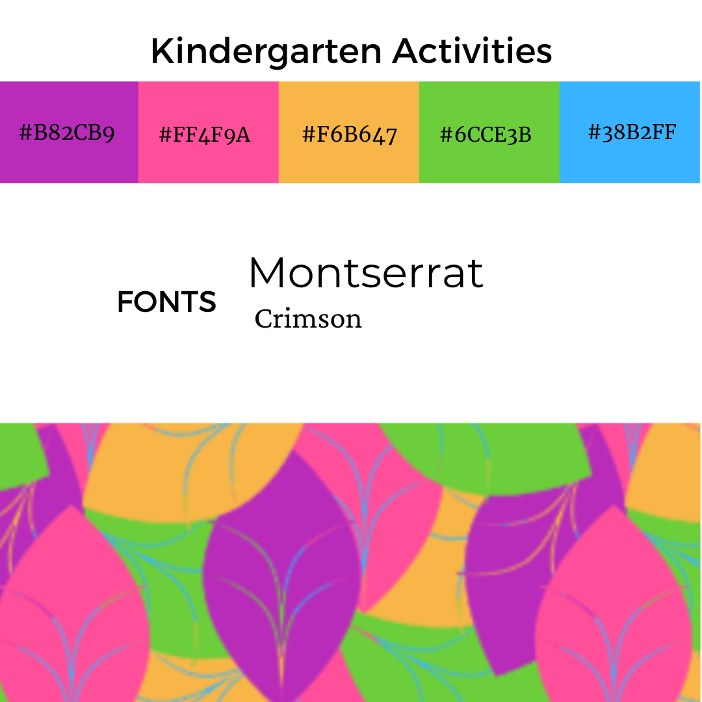

## Kindergarten Days

Welcome to a waldorf steinar inspired webpage for kindergarten children (ages 3-6). Full of seasonal activities to provide inspiration for parents
who are curious about home schooling, self isolating or looking for ideas to keep little ones engaged in learning and playing.

## **UX**

### **User Goals**

* The website has to work well on all kind of devices like mobile phones, tables and desktops.
* The website has to be fun and interactive.
* Visually appealing website.
* User should be able to easily create a profile.
* User can easily search for an seasonal activity based on date entered.
* User can save completed activities for the next login.
* User has an easy to understand dashboard that shows activities for the week with a completion icon to select/deselect as well as a progress bar.

### **User Stories**

* As a user, I would like to search for seasonal activites.
* As a user, I would like to have a simple and easy to understand dashboard of my weekly activities.
* As a user, I would like to save my completed activites.
* As a user, I would like to view activities yet to be completed.
* As a user, I would like to be able to have access to activities regardless of the device i'm using.
* As a user, I would like to upload photos of our completed activities to create a digital album for the year.
* As a user, I would like to print my week of activities and or digital album.

### **Site Owner Goals**
* To have a website that can easily create, read, update and delete activites and user profiles.
* To create a website that is personable and allows the user to feel empowered and involved in their childs learning and education.
* To allow the user to create memories of activities done with their child.
* To have a reliable data storage system for both information on activities and memories uploaded by the user.

### **User Requirements and Expectations**

#### **Requirements**

* A simple and easy way to navigate the website.
* An easy to understand dashboard with simple controls.
* Quick upload button to add to the memory album for later access.
* Easy way for admin to use CRUD functions for instructions or album.
* Ability to delete profile or album.

#### **Expectations**

* Easy to show completed activities.
* Easy to upload photos to memory album.
* Easy to download memory album of activities.
* Easy to see activities for the week on the dashboard
* Simple profile with information about child and memory album.

### **Design Choices**
### Colours Mood board and Mockups
I have used [ColourLovers](https://www.colourlovers.com/palettes) to find inspiration for my colour palette and scheme. I went for bright colours and 

##### FONT PAIRINGS
  **Montserrat** and **Crimson**  are the two fonts that I have chosen and seem to work well on education based websites.

## Wireframes

These wireframes were created using [Balsamiq](https://balsamiq.com/) during the Scope Plane 
part of the design and planning process for this project. 

You can find my wireframes below:

### [Mobile Wireframe : Home](wireframes/1.home-phone.png)
### [Mobile Wireframe : Theme of the Week](wireframes/2.Theme-Week-phone.png)
### [Mobile Wireframe : Activity Page](wireframes/3.Activity-Page-phone.png)

&nbsp;

### [Tablet Wireframe : Home](wireframes/4.home-ipad.png)
### [Tablet Wireframe : Theme of the Week ](wireframes/5.Theme-Week-ipad.png)
### [Tablet Wireframe : Activity Page](wireframes/6.Activity-Page-ipad.png)

&nbsp;

### [Desktop Wireframe: Home](wireframes/7.home-desktop.png)
### [Desktop Wireframe : Theme of the Week ](wireframes/8.Theme-Week-Desktop.png)
### [Desktop Wireframe : Activity Page](wireframes/9.Activity-Page-Desktop.png)

For a pdf version of all the wireframes you can access them here:  [WireFrame PDF](wireframes/Activity-wireframes.pdf)

### **Database Structure**

I have used MongoDB to set up the database for this project with the following collections: 

#### **Users:**

Key      | Value
---------|-----------
_id      | ObjectId
username | String
password | String

#### **Activites:**

Key               | Value
--------------------|-----------
_id                 | ObjectId
theme               | String
craft               | String
book                | String
circle_game         | String
handwork            | String
completed_activity  | Boolean

#### **Memory Album:**

Key             | Value
----------------|-----------
_id             | ObjectId
childs_name     | String
activity_date   | String
activity_image  | String
other_notes     | String
