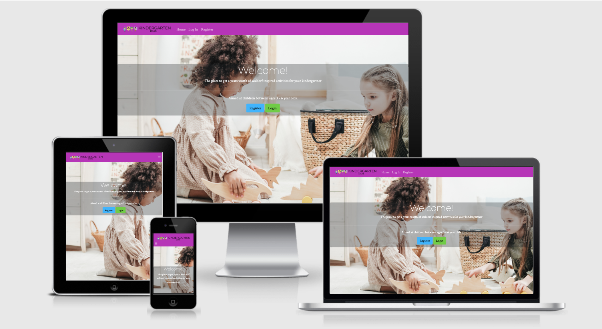
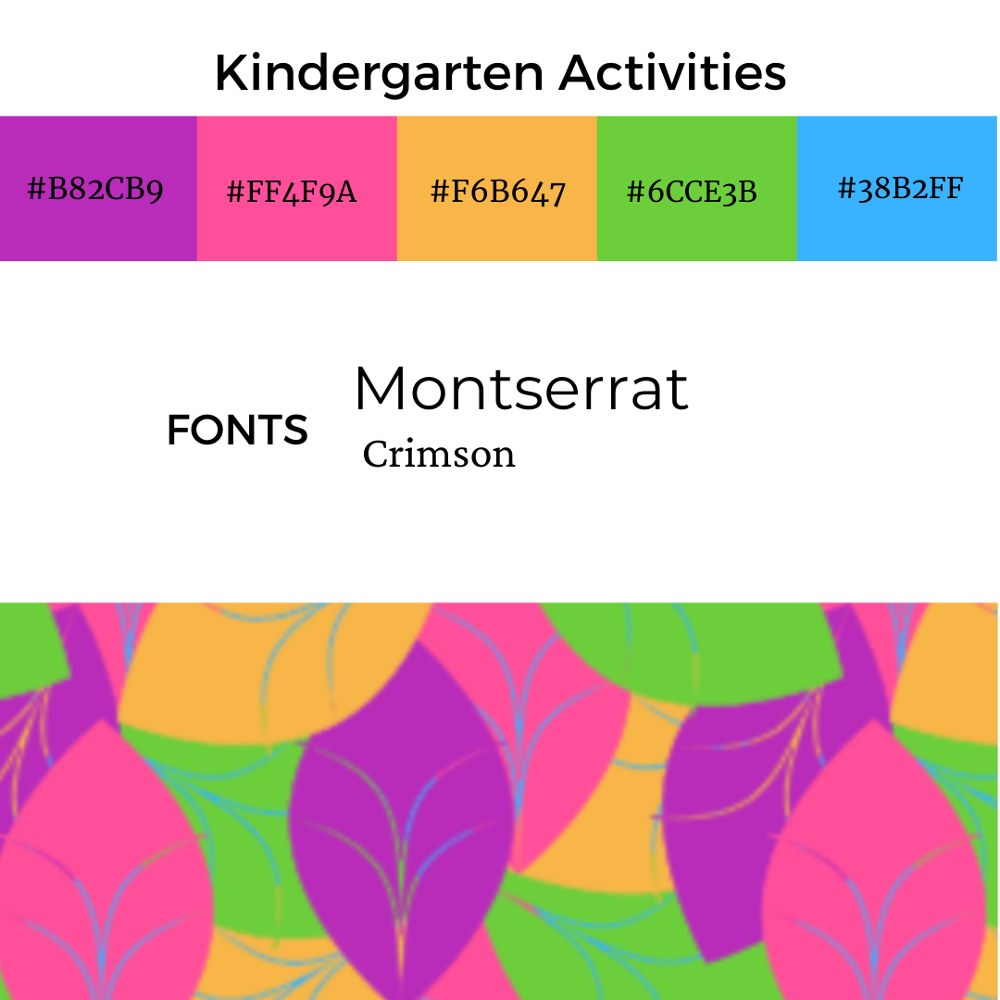
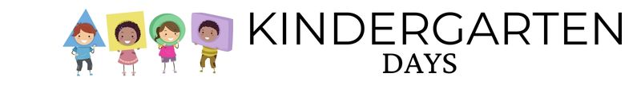

## Kindergarten Days

Welcome to a waldorf steinar inspired webpage for kindergarten children (ages 3-6). Full of seasonal activities to provide inspiration for parents
who are curious about home schooling, self isolating or looking for ideas to keep little ones engaged in learning and playing.

This website provides full CRUD functionality to the admin user to manipulate activities that are displayed to the standard user.

## **UX**

### **User Goals**

* The website has to work well on all kind of devices like mobile phones, tables and desktops.
* The website has to be fun and interactive.
* Visually appealing website.
* User should be able to easily create a profile.
* User can easily search for an seasonal activity based on date entered.
* User can save completed activities for the next login.
* User has an easy to understand dashboard that shows activities for the week with a completion icon to select/deselect as well as a progress bar.

### **User Stories**

* As a user, I would like to search for seasonal activites.
* As a user, I would like to have a simple and easy to understand dashboard of my weekly activities.
* As a user, I would like to save my completed activites.
* As a user, I would like to view activities yet to be completed.
* As a user, I would like to be able to have access to activities regardless of the device i'm using.
* As a user, I would like to upload photos of our completed activities to create a digital album for the year.
* As a user, I would like to print my week of activities and or digital album.

### **Site Owner Goals**
* To have a website that can easily create, read, update and delete activites and user profiles.
* To create a website that is personable and allows the user to feel empowered and involved in their childs learning and education.
* To allow the user to create memories of activities done with their child.
* To have a reliable data storage system for both information on activities and memories uploaded by the user.

### **User Requirements and Expectations**

#### **Requirements**

* A simple and easy way to navigate the website.
* An easy to understand dashboard with simple controls.
* Quick upload button to add to the memory album for later access.
* Easy way for admin to use CRUD functions for instructions or album.
* Ability to delete profile or album.

#### **Expectations**

* Easy to show completed activities.
* Easy to upload photos to memory album.
* Easy to download memory album of activities.
* Easy to see activities for the week on the dashboard
* Simple profile with information about child and memory album.


### **Design Choices**
### Colours Mood board and Mockups
I have used [ColourLovers](https://www.colourlovers.com/palettes) to find inspiration for my colour palette and scheme. I went for bright colours and 

##### FONT PAIRINGS
  **Montserrat** and **Crimson**  are the two fonts that I have chosen and seem to work well on education based websites.

##### ICONS

A Favicon was added to the site. I desigbed an orange circle with the letter K and green leaves using the chosen brand colours.




##### LOGO
I have created a simple and colourful logo to represent the purpose of the website using Canva. I have also used the chosen fonts of **Montserrat** and **Crimson** to create the logo and keep the consistency of fonts used throughout the site.




  
## Wireframes

These wireframes were created using [Balsamiq](https://balsamiq.com/) during the Scope Plane 
part of the design and planning process for this project. 

You can find my wireframes below:

### [Mobile Wireframe : Home](static/docs/wireframes/1.home-phone.png)
### [Mobile Wireframe : Theme of the Week](static/docs/wireframes/2.Theme-Week-phone.png)
### [Mobile Wireframe : Activity Page](static/docs/wireframes/3.Activity-Page-phone.png)

&nbsp;

### [Tablet Wireframe : Home](static/docs/wireframes/4.home-ipad.png)
### [Tablet Wireframe : Theme of the Week ](static/docs/wireframes/5.Theme-Week-ipad.png)
### [Tablet Wireframe : Activity Page](static/docs/wireframes/6.Activity-Page-ipad.png)

&nbsp;

### [Desktop Wireframe: Home](static/docs/wireframes/7.home-desktop.png)
### [Desktop Wireframe : Theme of the Week ](static/docs/wireframes/8.Theme-Week-Desktop.png)
### [Desktop Wireframe : Activity Page](static/docs/wireframes/9.Activity-Page-Desktop.png)


For a pdf version of all the wireframes you can access them here:  [WireFrame PDF](static/docs/wireframes/Activity-wireframes.pdf)

### **Database Structure**

I have used MongoDB to set up the database for this project with the following collections: 

#### **Users:**

Key      | Value
---------|-----------
_id      | ObjectId
username | String
password | String

#### **Activities:**

Key                         | Value
----------------------------|-----------
_id                         | ObjectId
month                       | String
theme                       | String 
letter_of_week              | String
book                        | String
book_description            | String
craft                       | String
craft_description           | String
game                        | String
game_description            | String
watercolour                 | String
watercolour_description     | String
dates_description           | String  


#### **Categories:**
Key                 | Value
--------------------|-----------
_id                 | ObjectId
Books               | String
Watercolour         | String
Craft               | String
Handwork            | String
Games               | String
Month               | String
Date                | String

 


## **Technologies used**


### **Languages**

* [HTML](https://en.wikipedia.org/wiki/HTML)
* [CSS](https://en.wikipedia.org/wiki/Cascading_Style_Sheets)
* [JavaScript](https://en.wikipedia.org/wiki/JavaScript)
* [Python](https://www.python.org/) 

### **Libraries and Frameworks**

- [Font Awesome](https://fontawesome.com/) to provide icons for the website.
- [Bootstrap](https://getbootstrap.com/) to simplify the structure of the website and make the website responsive easily.
- [Google Fonts](https://fonts.google.com/) to style the website fonts.

### **Tools**
- [Git](https://gist.github.com/derhuerst/1b15ff4652a867391f03) to handle version control.
- [GitPod](https://www.gitpod.io/) to write my code.
- [GitHub](https://github.com/) to store and share all project code remotely.
- [Heroku](https://www.heroku.com/) to deploy my website
- [Balsamiq](https://balsamiq.com/) to create the wireframes for this project.
* [W3C HTML Validation Service](https://validator.w3.org/) to validate HTML code
* [W3C CSS Validation Service](https://jigsaw.w3.org/css-validator/) to validate CSS code
- [Am I Responsive](http://ami.responsivedesign.is/) to create the website mockups
- [MongoDB Atlas](https://www.mongodb.com/) for database storage
* [Flask](https://flask.palletsprojects.com/en/1.1.x/) to support extensions in adding functionality to the website
* [PyMongo](https://docs.mongodb.com/drivers/pymongo/) to work with MongoDB from Python.
* [Jinja](https://jinja.palletsprojects.com/en/2.11.x/) templating language for Python.

## **Deployment**

### Local Deployment

I have created the Kindergarten Activities project using Github, from there I used [Gitpod](https://gitpod.io/) to write my code. 
Then I used commits to git followed by "git push" to my GitHub repository. 
I've deployed this project to Heroku and used "git push heroku master" to make sure my pushes to GitHub were also made to Heroku. 

This project can be ran locally by following the following steps: (
I used Gitpod for development, so the following steps will be specific to Gitpod. 
You will need to adjust them depending on your IDE. You can find more information about installing packages using pip and virtual environments [here](https://packaging.python.org/guides/installing-using-pip-and-virtual-environments/)

To clone the project: 

1. From the application's repository, click the "code" button and download the zip of the repository.
1. Access the folder in your terminal window and install the application's [required modules](https://#) using the following command:

    ```
    pip3 install -r requirements.txt

1. Sign-in or sign-up to [MongoDB](https://www.mongodb.com/) and create a new cluster
    * Within the Sandbox, click the collections button and after click Create Database (Add My Own Data) called kindergarten_days
    * Set up the following collections: users, activities, memory_album [Click here to see the exact Database Structure](#database-structure)

    * Under the Security Menu on the left, select Database Access.
    * Add a new database user, and keep the credentials secure
    * Within the Network Access option, add IP Address 0.0.0.0

1. In your IDE, create a file containing your environmental variables called env.py at the root level of the application. 
    It will need to contain the following lines and variables:
    ```
    import os

    os.environ["IP"] = "0.0.0.0"
    os.environ["PORT"] = "5000"
    os.environ["SECRET_KEY"] = "YOUR_SECRET_KEY"
    os.environ["DEBUG"] = "True"
    os.environ["MONGO_URI"] = "YOUR_MONGODB_URI"
    os.environ["MONGO_DBNAME"]= "DATABASE_NAME" 
    ```

    Please note that you will need to update the **SECRET_KEY** with your own secret key, as well as the **MONGO_URI** and **MONGO_DBNAME** variables with those provided by MongoDB.
    Tip for your SECRET_KEY, you can use a [Password Generator](https://passwordsgenerator.net/) in order to have a secure secret key. 
    I personlly recommend a length of 24 characters and exclude Symbols.
    To find your MONGO_URI, go to your clusters and click on connect. Choose connect your application and copy the link provided. 
    Don't forget to update the necessary fields like password and database name. 

    If you plan on pushing this application to a public repository, ensure that env.py is added to your .gitignore file.

1. The application can now be run locally. In your terminal, type the following command 
    ```
    python3 app.py. 
    ```
    
### To deploy your project on Heroku, use the following steps: 

1. Login to your Heroku account and create a new app. Choose your region. 
1. Ensure the Procfile and requirements.txt files exist are present and up-to-date in your local repository.  
    Requirements:
    ```
    pip3 freeze --local > requirements.txt
    ```
    Procfile:
    ```
    echo web: python app.py > Procfile
    ```
1. The Procfile should contain the following line:
    ```
    web: python app.py
    ```

1. Scroll down to "deployment method"-section. Choose "Github" for automatic deployment.
1. From the inputs below, make sure your github user is selected, and then enter the name for your repo. Click "search". When it finds the repo, click the "connect" button.
1. Scroll back up and click "settings". Scroll down and click "Reveal config vars". Set up the same variables as in your env.py (IP, PORT, SECRET_KEY, MONGO_URI and MONGODB_NAME):
    !You shouldn't set the DEBUG variable in under config vars, only in your env.py to prevent DEBUG being active on live website. 

    ```
    IP = 0.0.0.0
    PORT = 5000
    SECRET_KEY = YOUR_SECRET_KEY
    MONGO_URI = YOUR_MONGODB_URI
    MONGO_DBNAME = DATABASE_NAME
    ```

1. Scroll back up and click "Deploy". Scroll down and click "Enable automatic deployment".
1. Just beneath, click "Deploy branch". Heroku will now start building the app. When the build is complete, click "view app" to open it.
1. In order to commit your changes to the branch, use git push to push your changes.