## Kindergarten Days

Welcome to a waldorf steinar inspired webpage for kindergarten children (ages 3-6). Full of seasonal activities to provide inspiration for parents
who are curious about home schooling, self isolating or looking for ideas to keep little ones engaged in learning and playing.

This website provides full CRUD functionality to the admin user to manipulate activities that are displayed to the standard user.

## **UX**

### **User Goals**

* The website has to work well on all kind of devices like mobile phones, tables and desktops.
* The website has to be fun and interactive.
* Visually appealing website.
* User should be able to easily create a profile.
* User can easily search for an seasonal activity based on date entered.
* User can save completed activities for the next login.
* User has an easy to understand dashboard that shows activities for the week with a completion icon to select/deselect as well as a progress bar.

### **User Stories**

* As a user, I would like to have a simple and easy to understand dashboard of my weekly activities.
* As a user, I would like to search for current activites that correspond with the current season.
* As a user, I would like to be able to have access to activities regardless of the device i'm using.
* As an admin user, I would like to carry out CRUD functions.


### **Site Owner Goals**
* To have a website that can easily create, read, update and delete activites and user profiles.
* To create a website that is personable and allows the user to feel empowered and involved in their childs learning and education.
* To allow the user to create memories of activities done with their child.
* To have a reliable data storage system for both information on activities and memories uploaded by the user.

### **User Requirements and Expectations**

#### **Requirements**

* A simple and easy way to navigate the website.
* An easy to understand dashboard with simple controls.
* Quick upload button to add to the memory album for later access.
* Easy way for admin to use CRUD functions for instructions or album.
* Ability to delete profile or album.

#### **Expectations**

* Easy to show completed activities.
* Easy to upload photos to memory album.
* Easy to download memory album of activities.
* Easy to see activities for the week on the dashboard
* Simple profile with information about child and memory album.


### **Design Choices**
### Colours Mood board and Mockups
I have used [ColourLovers](https://www.colourlovers.com/palettes) to find inspiration for my colour palette and scheme. I went for bright colours and 

##### FONT PAIRINGS
  **Montserrat** and **Crimson**  are the two fonts that I have chosen and seem to work well on education based websites.

##### ICONS

A Favicon was added to the site. I designed an orange circle with the letter K and green leaves using the chosen brand colours.


##### LOGO
I have created a simple and colourful logo to represent the purpose of the website using Canva. I have also used the chosen fonts of **Montserrat** and **Crimson** to create the logo and keep the consistency of fonts used throughout the site.


  
## Wireframes

These wireframes were created using [Balsamiq](https://balsamiq.com/) during the Scope Plane 
part of the design and planning process for this project. 

You can find my wireframes below:

### [Mobile Wireframe : Home](docs/wireframes/1.home-phone.png)
### [Mobile Wireframe : Theme of the Week](docs/wireframes/2.Theme-Week-phone.png)
### [Mobile Wireframe : Activity Page](docs/wireframes/3.Activity-Page-phone.png)

&nbsp;

### [Tablet Wireframe : Home](docs/wireframes/4.home-ipad.png)
### [Tablet Wireframe : Theme of the Week ](docs/wireframes/5.Theme-Week-ipad.png)
### [Tablet Wireframe : Activity Page](docs/wireframes/6.Activity-Page-ipad.png)

&nbsp;

### [Desktop Wireframe: Home](docs/wireframes/7.home-desktop.png)
### [Desktop Wireframe : Theme of the Week ](docs/wireframes/8.Theme-Week-Desktop.png)
### [Desktop Wireframe : Activity Page](docs/wireframes/9.Activity-Page-Desktop.png)


For a pdf version of all the wireframes you can access them here:  [WireFrame PDF](docs/wireframes/Activity-wireframes.pdf)

# Features
## Existing Features

### Elements on the page

#### REGISTER
A simple registration form was created to collect user name and password to send to the database using the register button. 

Form Validations have been added to provide feedback to the user.

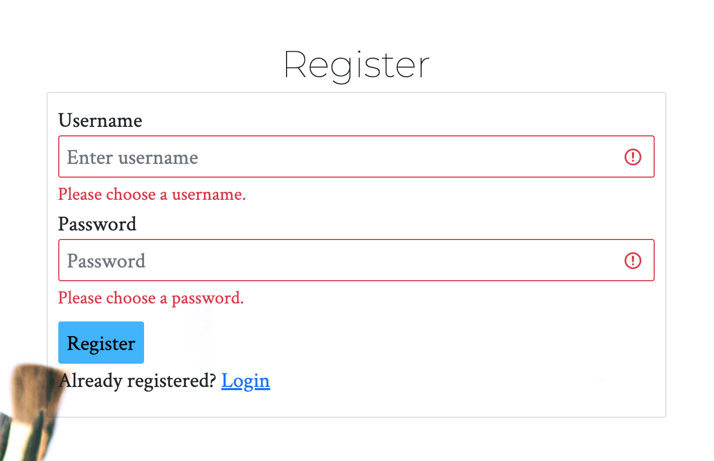
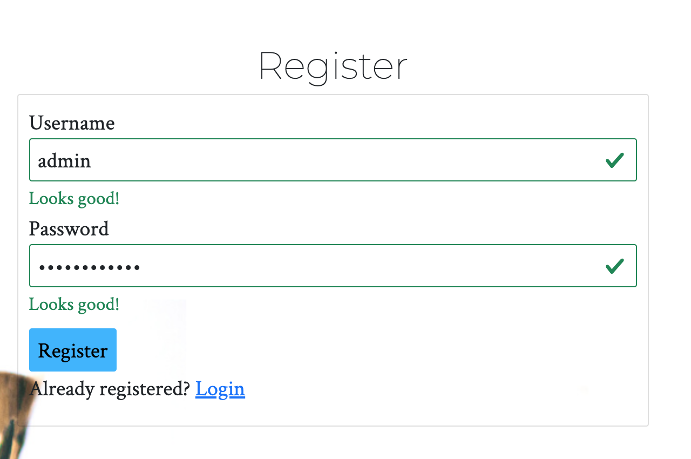

There is a flash warning message if a user already exists. A link to login from the registration page is available if a user has already been registered and exists on the database.

A flash message appears if registration was successful and a user profile is created. The user is immediately logged into profile page with access to view the activities.

#### LOG IN
A simple login form was created to find user in the database. Form validations have been added to provide feedback to the user.
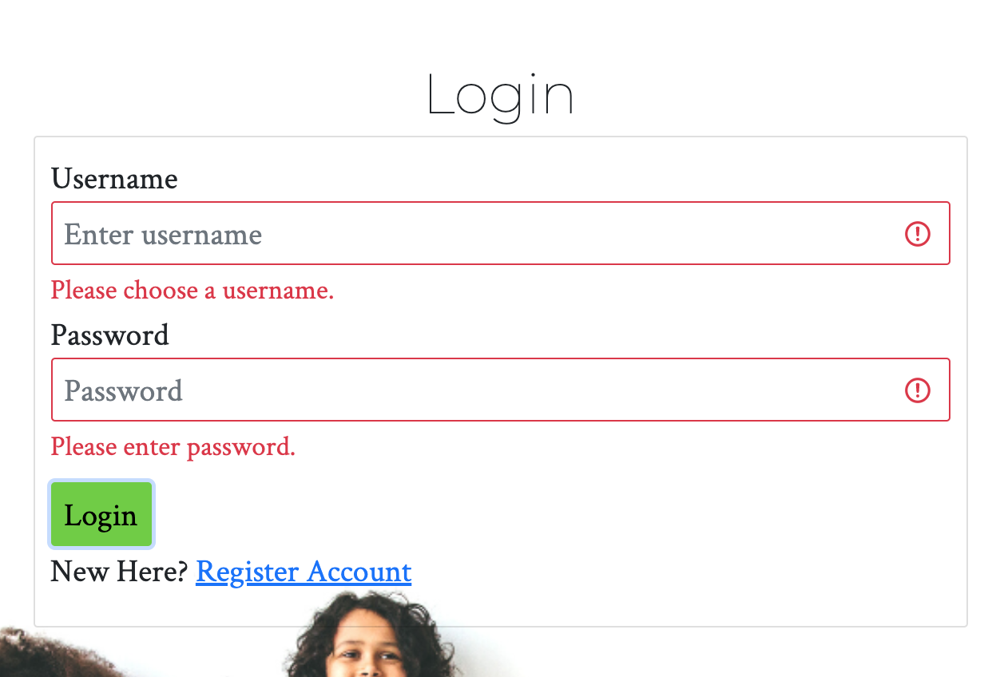
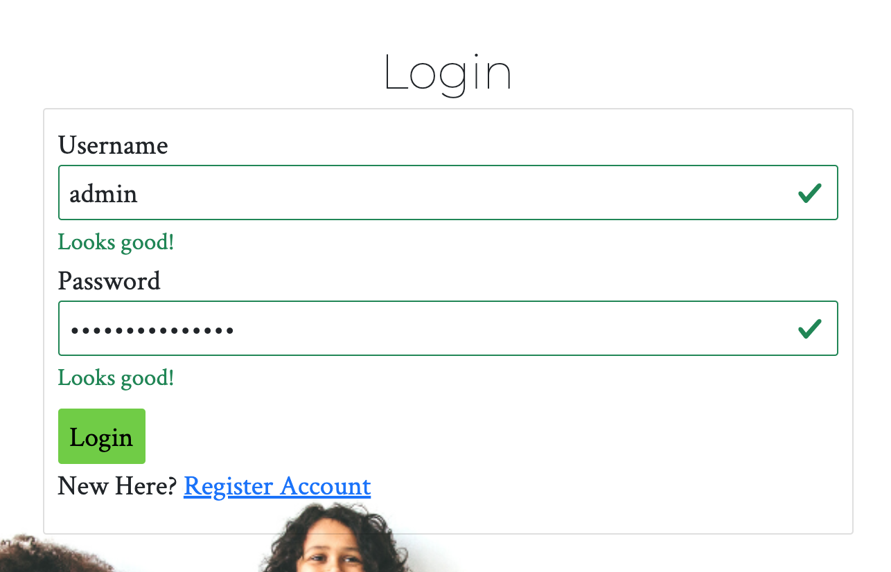

There is a flash warning message if incorrect username or password is entered. A link to register from the login page is available if a user has not registered yet.

A flash message appears if login was successful welcoming the user. The user is immediately logged into profile page with access to view the activities.

The home, login and register pages are no longer visible once the user has logged in.


#### ACTIVITIES
This page displays the current activities for the month on a weekly basis with an accordion that holds more information for each activity of the week.

There is also a dropdown search function to choose and view a different month.
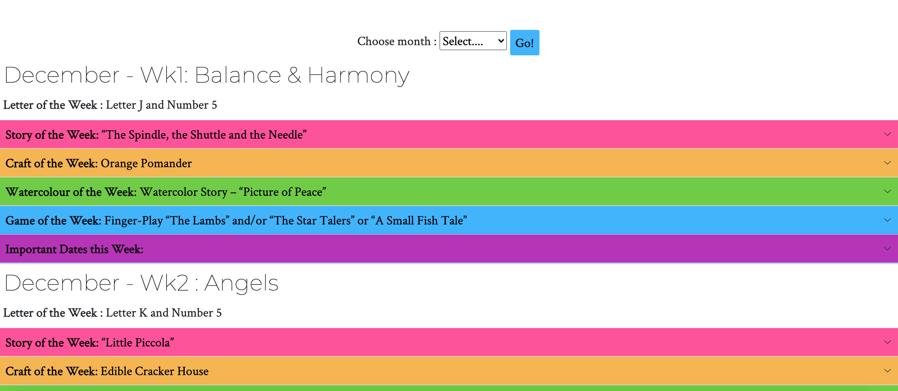

#### ADMIN USER and USER
The admin user has complete access to carry out CRUD functions while the standard user only has access to read and search activities.

The admin user has the edit and delete buttons that appear next to each weekly activity.
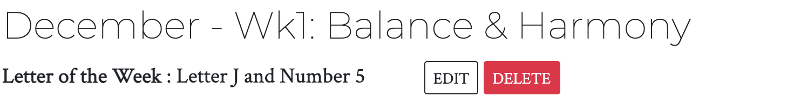
##### **CREATE**
Admin user can create a new activity for the week by filling out the form which gets sent to the database.
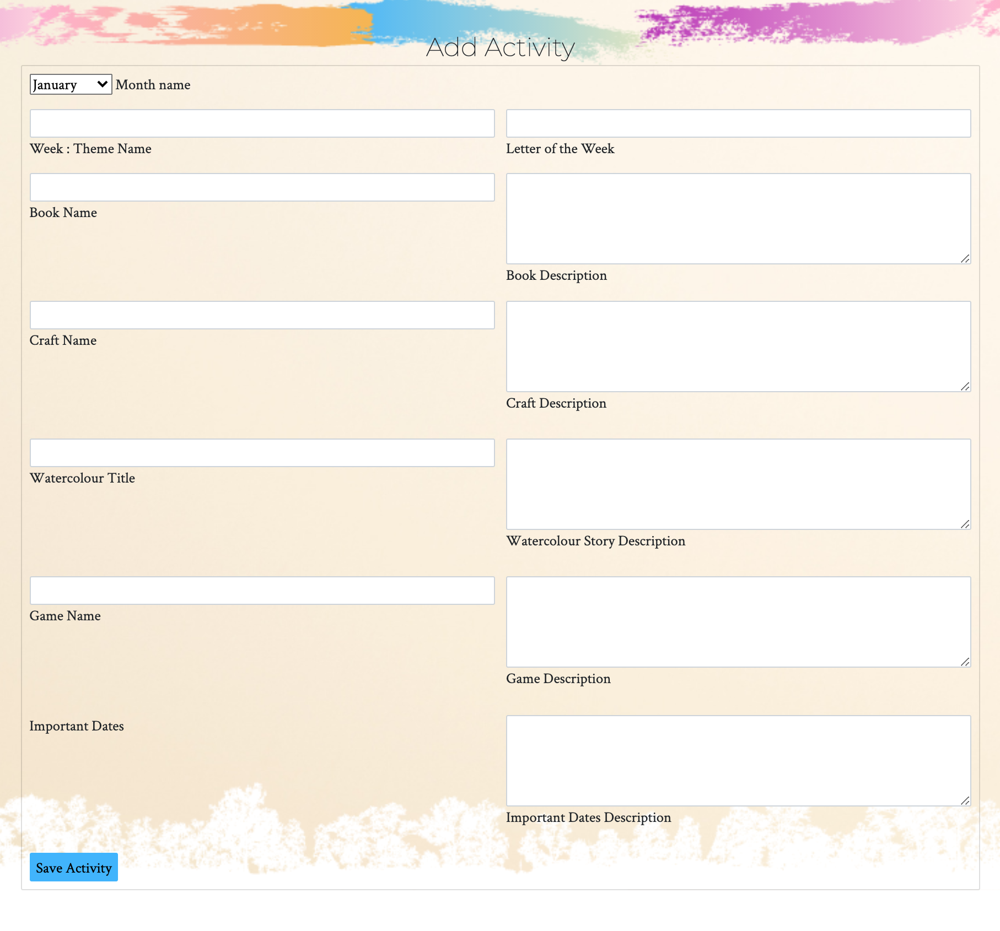
##### **READ**
All logged in users have access to read the activities and information contained inside each accordion.
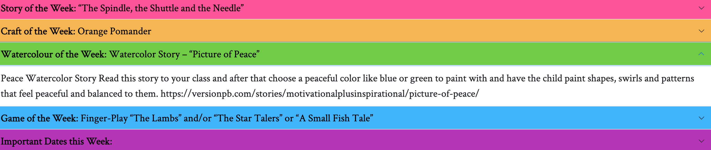
##### **UPDATE**
Admin user can edit activities for the week by clicking the edit button which loads up the pre-populated form.

Once changes have been saved a flash message displays the named activity has been successfully updated.
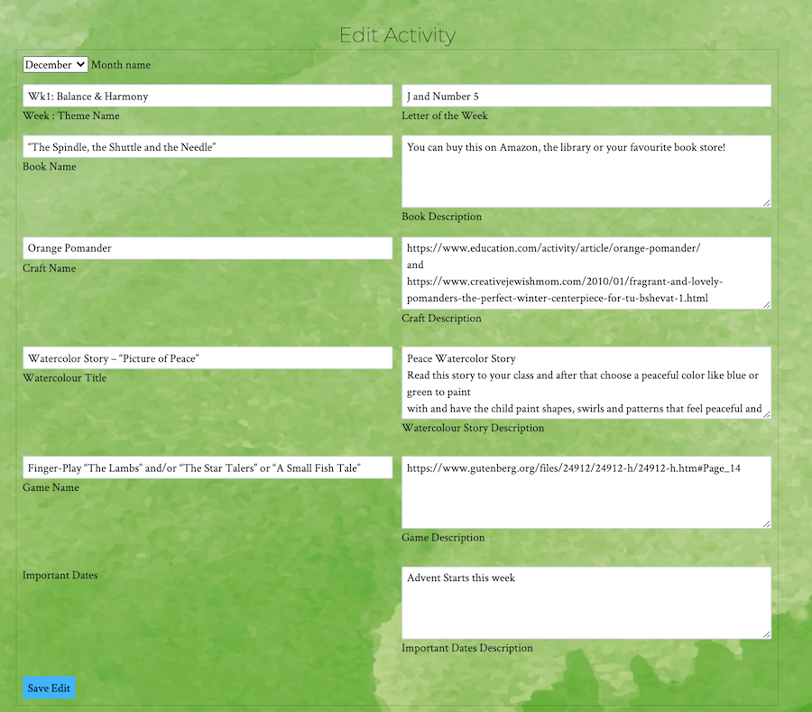

##### **DELETE**
Admin user can delete weekly activities. A modal pop up message warns user of permanently deleting activity and for user to confirm this action.

Once a flash message appears confirming it has been successfully deleted and user is returned to the current month of activities page.


##### **USER PROFILE**
User profile displays username and a link to a meditation page which opens in a new window. I created the meditation page in a previous project and thought it would be a useful tool to have on hand in the users profile.
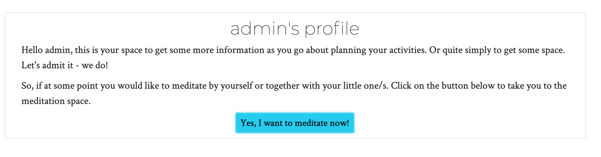
#### LOG OUT
Users can log out easily from the navbar. A flash message appears to confirm the user has been logged out and is redirected to login page.

#### 404 PAGE
If users try to access a page that doesn't exist, they will be directed to a 404 page which I designed.
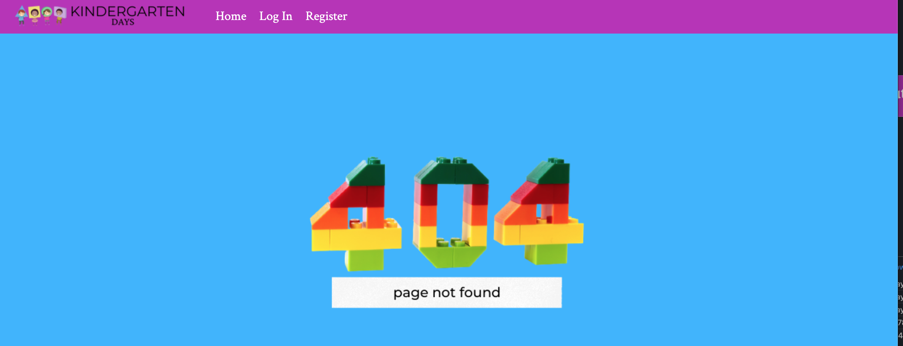
#### 500 PAGE
I designed a 500 page should the site break for whatever reason.


### Features Left to Implement

- Upload photos of activities to create digital album
- Print weekly activities and or digital album


### **Database Structure**

I have used MongoDB to set up the database for this project with the following collections: 

#### **Users:**

Key      | Value
---------|-----------
_id      | ObjectId
username | String
password | String

#### **Activities:**

Key                         | Value
----------------------------|-----------
_id                         | ObjectId
month                       | String
theme                       | String 
letter_of_week              | String
book                        | String
book_description            | String
craft                       | String
craft_description           | String
game                        | String
game_description            | String
watercolour                 | String
watercolour_description     | String
dates_description           | String  


#### **Categories:**
Key                 | Value
--------------------|-----------
_id                 | ObjectId
Books               | String
Watercolour         | String
Craft               | String
Handwork            | String
Games               | String
Month               | String
Date                | String

 


## **Technologies used**


### **Languages**

- [HTML](https://en.wikipedia.org/wiki/HTML)
- [CSS](https://en.wikipedia.org/wiki/Cascading_Style_Sheets)
- [JavaScript](https://en.wikipedia.org/wiki/JavaScript)
- [Python](https://www.python.org/) 

### **Libraries and Frameworks**

- [Font Awesome](https://fontawesome.com/) to provide icons for the website.
- [Bootstrap](https://getbootstrap.com/) to simplify the structure of the website and make the website responsive easily.
- [Google Fonts](https://fonts.google.com/) to style the website fonts.

### **Tools**
- [Git](https://gist.github.com/derhuerst/1b15ff4652a867391f03) to handle version control.
- [GitPod](https://www.gitpod.io/) to write my code.
- [GitHub](https://github.com/) to store and share all project code remotely.
- [Heroku](https://www.heroku.com/) to deploy my website
- [Balsamiq](https://balsamiq.com/) to create the wireframes for this project.
- [Google Lighthouse](https://web.dev/lighthouse-accessibility/) to carry out accessibility audits
- [WAVE](https://wave.webaim.org/) to carry out detailed accessibility evaluation
- [W3C HTML Validation Service](https://validator.w3.org/) to validate HTML code
- [W3C CSS Validation Service](https://jigsaw.w3.org/css-validator/) to validate CSS code
- [Am I Responsive](http://ami.responsivedesign.is/) to create the website mockups
- [Responsinator](http://www.responsinator.com/) to test device responsiveness
- [MongoDB Atlas](https://www.mongodb.com/) for database storage
- [Flask](https://flask.palletsprojects.com/en/1.1.x/) to support extensions in adding functionality to the website
- [PyMongo](https://docs.mongodb.com/drivers/pymongo/) to work with MongoDB from Python.
- [Jinja](https://jinja.palletsprojects.com/en/2.11.x/) templating language for Python.

## **Testing**


#### User story:
**As a user, I would like to have a simple and easy to understand dashboard of my weekly activities.**

* **Plan**  
My plan is to create an easy to understand dashboard of activities for the month separated into weekly blocks. Each block will have 5 types of activities for the week.

* **Implementation**
The activities are separated on a weekly basis and the current month is displayed when user is logged in. The activities for each week are also colour coded in an accordion style to make it easier to identify the type of activity as well as to read more information on the activity.

    Pink = Story

    Orange = Craft

    Green = Watercolour

    Blue = Game

    Purple = Important Dates

* **Result**
Accordions open and close individually and information is easy to accesss and understand
* **Verdict**  
Activities are pulled from the database and working as expected. Accordions working as expected.

#### User story:
**As a user, I would like to search for current activites that correspond with the current season.**

* **Plan**  
My plan is to add a search button that allows to search ahead of time or back in time for activities in specific month.
* **Implementation** 
I added a drop down select function with months in the year listed and a blue go button to search
* **Result**
Users can easily move between the months in the year to search for activities
* **Verdict**  
Dropdown and search working as expected.


#### User story:
**As a user, I would like to be able to have access to activities regardless of the device i'm using.**

* **Plan**  
My plan is to make the website responsive so that it works on various devices and screen sizes.
* **Implementation** 
Bootstrap is responsive by default so I will test break points both manually and using tools such as chrome and responsinator.
* **Test**
I have tested on various screen sizes and devices.

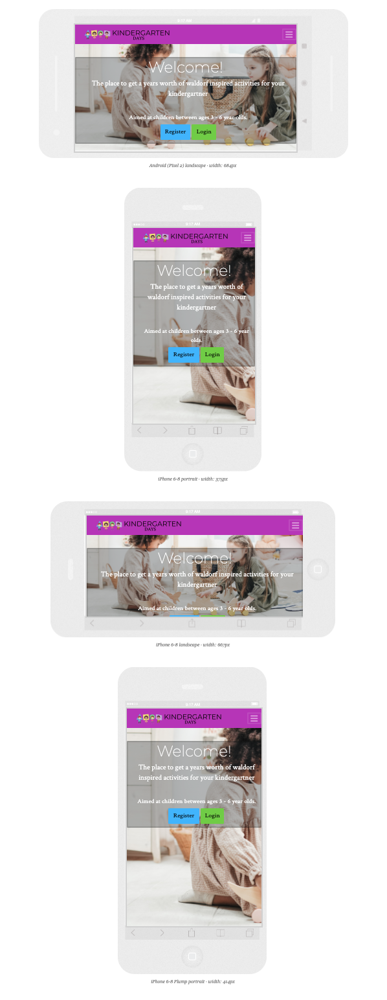
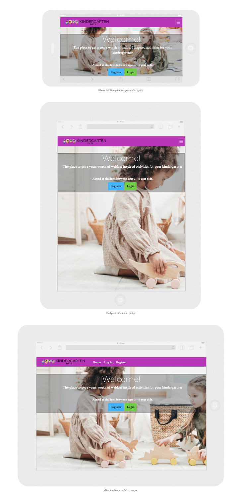


* **Result**
All working and displaying as expected.
* **Verdict** 
Site is responsive and working as expected.

#### User story:
**As an admin user, I would like to carry out CRUD functions.**

* **Plan**  
My plan is allow admin user to carry out CRUD functions easily.
* **Implementation**
I will create a form to enable admin to add activities to the database, enabling easy creation of new activites.

I will also create an edit form that will pull out activities from the database to allow admin to update the information stored.

Finally, a delete button with a warning pop up to confirm admin wants to delete a block of activities for the week.
* **Test** 
I have test all forms and buttons work and information entered is stored and removed from the database.
* **Result**
Submit buttons and forms working as expected.
* **Verdict** 
CRUD functions for admin working as expected.

## **Validation Reports**

[HTML Validation](docs/wireframes/validations/html-validation.png)

[CSS Validation](docs/wireframes/validations/css-validation.png)

[JS Validation](docs/wireframes/validations/js-validation.png)

[Accessibility](docs/wireframes/validations/accessibility-audit.png)

## **Bugs**

### **Flash message not showing on correct pages**

* **Bug**  
Flash messages are ending up in user profile page rather than the current page.

* **Fix**       
Added for message to correct pages.

* **Verdict**    
Flash messages are now displaying on the correct pages.

### **Text inside accordion is not responsive**

* **Bug**  
Text goes outside of accordion so there is scrolling left to right to read the text.

* **Fix**       
Add text break to accordion body div.

* **Verdict**    
Text inside accordion behaving as expected.

### **Deployed site on Heroku stopped working**

* **Bug**  
Deployed website no longer working

* **Fix**       
Update requirements.txt file

* **Verdict**    
Deployed site working as expected.

## **Deployment**

### Local Development

I have created the Kindergarten Activities project using Github, from there I used [Gitpod](https://gitpod.io/) to write my code. 
Then I used commits to git followed by "git push" to my GitHub repository. 
I've deployed this project to Heroku and used "git push heroku master" to make sure my pushes to GitHub were also made to Heroku. 

This project can be ran locally by following the following steps: (
I used Gitpod for development, so the following steps will be specific to Gitpod. 
You will need to adjust them depending on your IDE. You can find more information about installing packages using pip and virtual environments [here](https://packaging.python.org/guides/installing-using-pip-and-virtual-environments/)

To clone the project: 

1. From the application's repository, click the "code" button and download the zip of the repository.
1. Access the folder in your terminal window and install the application's [required modules](https://#) using the following command:

    ```
    pip3 install -r requirements.txt

1. Sign-in or sign-up to [MongoDB](https://www.mongodb.com/) and create a new cluster
    * Within the Sandbox, click the collections button and after click Create Database (Add My Own Data) called kindergarten_days
    * Set up the following collections: users, activities, memory_album [Click here to see the exact Database Structure](#database-structure)

    * Under the Security Menu on the left, select Database Access.
    * Add a new database user, and keep the credentials secure
    * Within the Network Access option, add IP Address 0.0.0.0

1. In your IDE, create a file containing your environmental variables called env.py at the root level of the application. 
    It will need to contain the following lines and variables:
    ```
    import os

    os.environ["IP"] = "0.0.0.0"
    os.environ["PORT"] = "5000"
    os.environ["SECRET_KEY"] = "YOUR_SECRET_KEY"
    os.environ["DEBUG"] = "True"
    os.environ["MONGO_URI"] = "YOUR_MONGODB_URI"
    os.environ["MONGO_DBNAME"]= "DATABASE_NAME" 
    ```

    Please note that you will need to update the **SECRET_KEY** with your own secret key, as well as the **MONGO_URI** and **MONGO_DBNAME** variables with those provided by MongoDB.
    Tip for your SECRET_KEY, you can use a [Password Generator](https://passwordsgenerator.net/) in order to have a secure secret key. 
    I personlly recommend a length of 24 characters and exclude Symbols.
    To find your MONGO_URI, go to your clusters and click on connect. Choose connect your application and copy the link provided. 
    Don't forget to update the necessary fields like password and database name. 

    If you plan on pushing this application to a public repository, ensure that env.py is added to your .gitignore file.

1. The application can now be run locally. In your terminal, type the following command 
    ```
    python3 app.py. 
    ```
    
### To deploy your project on Heroku, use the following steps: 

1. Login to your Heroku account and create a new app. Choose your region. 
1. Ensure the Procfile and requirements.txt files exist are present and up-to-date in your local repository.  
    Requirements:
    ```
    pip3 freeze --local > requirements.txt
    ```
    Procfile:
    ```
    echo web: python app.py > Procfile
    ```
1. The Procfile should contain the following line:
    ```
    web: python app.py
    ```

1. Scroll down to "deployment method"-section. Choose "Github" for automatic deployment.
1. From the inputs below, make sure your github user is selected, and then enter the name for your repo. Click "search". When it finds the repo, click the "connect" button.
1. Scroll back up and click "settings". Scroll down and click "Reveal config vars". Set up the same variables as in your env.py (IP, PORT, SECRET_KEY, MONGO_URI and MONGODB_NAME):
    !You shouldn't set the DEBUG variable in under config vars, only in your env.py to prevent DEBUG being active on live website. 

    ```
    IP = 0.0.0.0
    PORT = 5000
    SECRET_KEY = YOUR_SECRET_KEY
    MONGO_URI = YOUR_MONGODB_URI
    MONGO_DBNAME = DATABASE_NAME
    ```

1. Scroll back up and click "Deploy". Scroll down and click "Enable automatic deployment".
1. Just beneath, click "Deploy branch". Heroku will now start building the app. When the build is complete, click "view app" to open it.
1. In order to commit your changes to the branch, use git push to push your changes.

## Credits

### Content - Media - Inspiration

I have used the following websites to gather ideas, information and code examples for the overall content of my website. This website would not have been possible without all these amazing resources: 

- [Earth Schooling](https://earthschooling.info/thebearthinstitute/about-earthschooling/)

- [Google Searches](https://www.google.co.uk/)

- [Project Gutenberg](https://www.gutenberg.org/)

- [You Tube Searches](https://www.youtube.com/)

- [Story Arts -Aesops Fables](https://www.storyarts.org/library/aesops/)


### Acknowledgements

I'm not sure I would have done all this work without the incredible support and encouragement from my mentor Simen ([Eventyret_mentor](https://github.com/Eventyret)), personal circumstances made it challenging to keep going but he made sure I had the right amount of support to keep me going.

I thoroughly enjoyed bringing this project to life from a small idea in my head. A big shout out to all the tutors who helped me when my brain felt scrambled, your simple explanations made me see my code from a fresh new perspective.

Thank you also to student services for checking in on me too! It was very much appreciated.